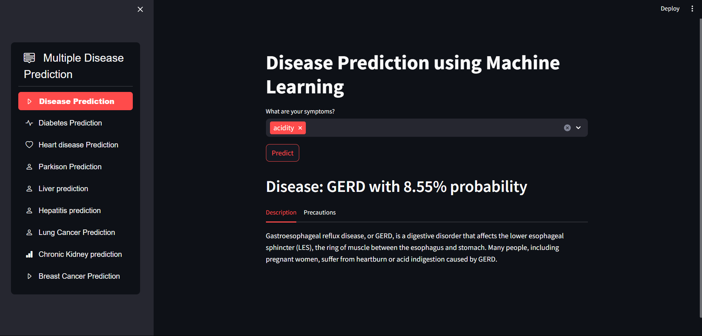

# 🔬 Disease-Prediction


<p align="center">
  
</p>

## 📋 Project Description

Disease-Prediction is a machine learning project designed to predict various diseases based on input data. This project uses Python for data processing, model training, and prediction. The goal is to provide accurate and efficient disease predictions to assist in early diagnosis and treatment.

### Key Features
- 🧠 Advanced ML algorithms for accurate disease prediction
- ⚡ Fast processing and real-time results
- 🖥️ User-friendly Streamlit interface
- 📊 Comprehensive data visualization
- 📱 Responsive design for all devices

## 🚀 Installation Instructions

To get started with the project, follow these installation steps:

1. **Clone the Repository**
   ```bash
   git clone https://github.com/mukundjha-mj/Disease-Prediction.git
   cd Disease-Prediction
   ```

2. **Install Dependencies**
   ```bash
   pip install -r requirements.txt
   ```

## 💻 Usage

To use the Disease-Prediction model, follow these steps:

1. **Prepare the Data**
   - Ensure your input data is in the correct format as required by the model.
   - Place the data in the appropriate directory.

2. **Run the Streamlit App**
   ```bash
   streamlit run .\app.py
   ```

3. **View the Results**
   - The predictions will be displayed in the Streamlit app interface.

<p align="center">
  
</p>

## 🧪 Supported Diseases

The current model is trained to predict the following diseases:
- Diabetes
- Heart Disease
- Pneumonia
- Liver Disease
- Cancer
- *And more...*

## 🤝 Contributing

We welcome contributions to improve the Disease-Prediction project. To contribute:

1. **Fork the Repository**
   - Click the "Fork" button on the top right of the repository page.

2. **Create a Feature Branch**
   ```bash
   git checkout -b feature/your-feature-name
   ```

3. **Commit Your Changes**
   ```bash
   git commit -m "Add some feature"
   ```

4. **Push to the Branch**
   ```bash
   git push origin feature/your-feature-name
   ```

5. **Create a Pull Request**
   - Go to your forked repository on GitHub.
   - Click the "New Pull Request" button.

## 📝 License

This project is licensed under the MIT License. See the [LICENSE](LICENSE) file for more information.

## 📬 Contact Information

For any questions or inquiries, please contact:

### Mukund Jha
- 👨‍💻 GitHub: [mukundjha-mj](https://github.com/mukundjha-mj)
- 📧 Email: mukundjha204@gmail.com


---

<p align="center">Made with ❤️ by Mukund Jha</p>